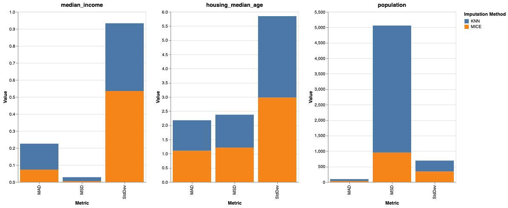

# Data-Imputation

### Overview

This project addresses a significant challenge in a housing dataset: the presence of substantial missing data. Specifically, three critical columns - 'Median Income', 'Housing Median Age', and 'Population' - each had 10,320 missing values, amounting to exactly 50% of their data. Recognising the importance of these columns in understanding the housing market, we embarked on a detailed exploratory data analysis (EDA) and employed advanced imputation techniques to restore the dataset's completeness. Our objective was to determine the most effective imputation method, focusing on K-Nearest Neighbours (KNN) Imputation and Multiple Imputation by Chained Equations (MICE). The project aimed to validate the integrity and utility of these methods through a thorough comparative analysis using linear regression and statistical evaluation.

The analysis was conducted through the use of a Jupyter Notebook which can be viewed [here](https://nbviewer.org/github/NathanDawson/Apple_Music_Analysis/blob/main/Apple_Music.ipynb).

### Data Imputation Results

### Conclusion

This project aimed to tackle the challenge posed by extensive missing data in a critical housing dataset, with 50% of the data missing in three important columns. Through a comprehensive approach involving EDA, the application of KNN and MICE imputation methods, and rigorous statistical analysis, we have identified MICE as the superior method for handling such significant data gaps. This conclusion is drawn from its overall performance across various metrics, proving its efficacy in dealing with large-scale data imputation challenges. The findings from this project provide valuable insights into the selection and application of imputation methods in datasets with substantial missing information, offering a guideline for future data restoration endeavors.
